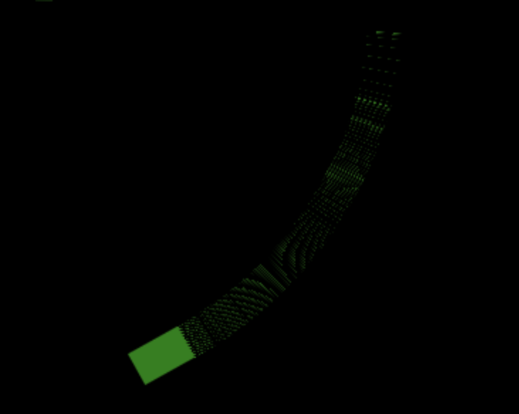

# Project 1: Asteroids


# Deployment link

https://mjpitkin.github.io/asteroids/

# Getting Started/Code Installation

Go to https://github.com/MJPitkin/asteroids/ to access the source code; to run it, all you need do is open index.html in your browser. The link at https://mjpitkin.github.io/asteroids/ will open the deployed project.

# Timeframe

The timeframe for this project was 2 weeks, and was completed independently.

# Technologies used

JavaScript, HTML, CSS, as well as Google’s font database.

# Brief

The brief was to build a web game using a mixture of HTML, JavaScript and CSS and host it online; the exact nature of the game was left up to the individual to decide, giving me a great deal of latitude with regards to how each of the aforementioned technologies would be utilised. A number of other technical requirements were however specified:

Render a game in the browser
Design logic for winning & visually display which player won

- Include separate HTML / CSS / JavaScript files
- Stick with KISS (Keep It Simple Stupid)** and DRY (Don't Repeat Yourself) principles
- Use JavaScript for DOM manipulation
- Deploy your game online, where the rest of the world can access it
- Use semantic markup for HTML and CSS (adhere to best practices)

# Planning

For this project I’d decided early on that I wanted to use HTML Canvas to make a game, as honestly it intrigued me; the scope of the tool reminded me of Flash games from the early 2000s, wherein people were capable of putting together fast paced highly responsive games that could run in a web browser. As I’m interested in both those sorts of games and in developing such in the future, it seemed like a natural choice. With that in mind I chose my Canvas project to be making a clone of the classic arcade game Asteroids: the player controls a ship on a 2d plane, asteroids fly in from offscreen, the player needs to shoot down and evade the incoming obstacles, gaining points for each asteroid they destroy. 

Initial planning in this case was deliberately light and high level; as I had only one lesson’s worth of exposure to Canvas, I knew that it was quite likely that I’d have to rewrite any planned game logic as I encountered its particular idiosyncrasies. The plan for the game thus consisted of a few lines in a text document:

“
- Draw ship
- Move ship with wasd/arrow keys
- Rotate ship with mouse position relative to ship position
- Shoot a projectile originating from the ship toward the mouse position
- Generate targets at the edge of the screen (or perhaps offscreen?)
- Send them moving in 
- Have collision with both projectiles (destroy, increase score) and player (die, lose life)
”

Asteroids does not traditionally have a “win” condition per se, but is simply an endurance test to get the highest score. There is however a “game end” condition, in the form of losing all your lives and getting a game over.

I was keen to get down to writing code as soon as possible, both to find what revisions would be needed as soon as possible and because I’ve tended to find that solutions present themselves more readily when working on the code than when looking at a flowchart or other abstraction. As in this project I was working solo (and thus was not coordinating with a wider team), I felt this approach was an acceptable way to prioritise my time.

In terms of time management, I knew that the vast bulk of reaching the minimum viable product stage with this project would be in the JavaScript work; to that end I made that my first priority, with page layout and aesthetic decisions following once the core functionality of the game was complete. 

#Build Process

Some people will document the build/code process by discussing the key stages they worked on. Others will do a day by day guide. It’s entirely up to you how you structure this, as long as you discuss all the key things above.

Insert your Build/Code Process here:


The first step was to simply get something drawn on screen, even if it was for now extremely crude. I added a canvas element to my index.html and applied some very basic CSS to it to change the background colour to black. Within script.js I created a constant to represent the canvas element in the DOM, along with a context constant ctx to actually manipulate it. I then created a very simple function to draw a 50 by 50 pixel rectangle at a given set of coordinates, to be called within a main draw() function that would be triggered every repaint by requestAnimationFrame(), as well as clearing the previous frame with clearRect().
```
  function drawPlayer() {
    //draws player ship
    ctx.beginPath();
    ctx.rect(playerX, playerY, 50, 50);
    ctx.fillStyle = "green";
    ctx.fill();
    ctx.closePath();
  }
 ```

 Event listeners for handling keypresses to steer the ship were added, setting directional boolean variables to true while the relevant keys were pressed, and false when they were released. The main draw() function was given a set of conditional if statements that would increment or decrement the X and Y coordinate variables of the ship if the associated booleans were true. I chose not to use if else conditionals or a switch statement, as by avoiding these it was possible to press multiple direction keys simultaneously and achieve diagonal movement. 
```
function draw() {
    //main renderer
    ctx.clearRect(0, 0, canvas.width, canvas.height);
    drawPlayer();
    if (rightPressed === true) {
      playerX += 1;
    }
    if (leftPressed === true) {
      playerX -= 1;
    }
    if (upPressed === true) {
      playerY -= 1;
    }
    if (downPressed === true) {
      playerY += 1;
    }
    requestAnimationFrame(draw);
  }
  draw();
  ```


Finally, this was all wrapped in an event listener checking to see if the DOM had loaded correctly, upon which the entire script would be permitted to run.

The next step was to prevent the ship from being able to fly offscreen. This was done by setting conditional limits in the movement code that prevented the ships X and Y coordinates from exceeding the bounds of the visible canvas, taking into account the ships dimensions as well.

What would have followed would have been making the ship rotate according to the position of the mouse cursor, but as I’ll get into in the challenges section that proved to be much more awkward than anticipated. After several days of effort I concluded that it a) was taking an excessive amount of time to debug and b) was not in fact necessary for the game to be functional. I instead redesigned the ship to be a circular flying saucer (and thus not need rotation) and moved on to the next task of giving the ship weaponry.

My initial idea was to create a drawing function like the one used for the player, that’d be called on a left mouse button click event to create the projectile. What I found however was that this method resulted in the clearRect() function in the main draw() function wiping the projectile off the screen as soon as it appeared, rendering the whole exercise useless. After discussing it with my tutor, it was suggested that I instead called the projectile drawing function (drawPlayerBullet() ) in draw() (thus always having it being rendered), and had the mouse click instead set it moving. This was achieved by increasing (or decreasing) its X and Y coordinates along a vector derived from the difference between the mouse position and the player position at the time of firing, while also having a counter variable incremented each frame; once the counter reached 60 the projectile would return to the ship and remain there until fired again. While the counter is counting up to 60 the bulletFired boolean is true and thus additional clicks of the mouse would not update the coordinates the projectile is using to calculate its trajectory. The development of making sure the projectile went in the right direction is covered in more detail in the challenges section.

```
if (bulletFired === false) {
      bulletX = playerX;
      bulletY = playerY;
    } else if (bulletCounter < 60) {
      bulletX += 10 * Math.cos(firingAngle);
      bulletY += 10 * Math.sin(firingAngle);
      bulletCounter += 1;
    } else if (bulletCounter >= 60) {
      bulletFired = false;
      bulletCounter = 0;
    }


document.addEventListener("click", mouseDownHandler, false);
  function mouseDownHandler(e) {
    // console.log("click");
    if (bulletFired === false) {
      bulletFired = true;
      mouseX = e.pageX - canvas.getBoundingClientRect().left;
      mouseY = e.pageY - canvas.getBoundingClientRect().top;
      posX = playerX;
      posY = playerY;
      firingAngle = Math.atan2(mouseY - posY, mouseX - posX);
    }
  }
  ```


One thing I had considered was rendering the projectile behind the ship, so that it would appear hidden until fired. However, I decided against this as keeping it visible gave the player a clear indication of when their weapon was ready to fire again.

Now that the ship was essentially fully functional (steers, aims, fires) the next steps were to give it targets to shoot and hazards to avoid. I chose to represent the asteroids as an array of objects, containing information on their X and Y coordinates, the angle they were flying at, a variable for adjusting their speed (though currently all of them fly at the same speed), a counter for determining whether it’s time for them to automatically reset (similar to the projectile code), and a status variable to determine if they’d been destroyed.

```
let asteroids = [
    {
      angle: 0,
      speed: 1,
      x: 0,
      y: 0,
      counter: 0,
      status: false,
    },
```

They also needed off-canvas starting positions to fly in from, which I defined as another array of objects:
```
const asteroidStartPoints = [
    { x: -30, y: -30 },
    { x: 240, y: -30 },
    { x: 510, y: -30 },
    { x: -30, y: 160 },
    { x: 510, y: 160 },
    { x: -30, y: 350 },
    { x: 240, y: 350 },
    { x: 510, y: 350 },
  ];
```

By representing both asteroids and their start positions in arrays, it made it straightforward to iterate across the whole set of asteroids and randomly select positions for them. When the game began, each asteroid would be assigned a random position out of the eight predefined spots, have a trajectory calculated to launch it at the ships current position, then be sent out at a fixed vector. I’d briefly experimented with setting the speed to be randomised, but the movement was jittery so that feature has been relegated to future work.

```
  function drawAsteroids() {
    for (i = 0; i < asteroids.length; i++) {
      if (asteroids[i].status === true) {
        asteroids[i].speed = 3;
        asteroids[i].x += asteroids[i].speed * Math.cos(asteroids[i].angle);
        asteroids[i].y += asteroids[i].speed * Math.sin(asteroids[i].angle);
        asteroids[i].counter++;
        ctx.beginPath();
        ctx.arc(asteroids[i].x, asteroids[i].y, 30, 0, Math.PI * 2);
        ctx.fillStyle = "#31013b";
        ctx.strokeStyle = "#d102fa";
        ctx.fill();
        ctx.stroke();
        ctx.closePath();
      } else {
        //choose new start position from array of 8 position objects
        newPos = Math.floor(Math.random() * 8);
        asteroids[i].x = asteroidStartPoints[newPos].x;
        asteroids[i].y = asteroidStartPoints[newPos].y;
        //calculate new angle based on current player position
        asteroids[i].angle = Math.atan2(
          playerY - asteroids[i].y,
          playerX - asteroids[i].x
        );
        asteroids[i].counter = 0;
        //reset counter
        //set status to true
        asteroids[i].status = true;
      }
    }
  }
```

The final part was to work out how to handle collision between projectiles, asteroids and of course the player’s ship. This was done by calculating the distance between the centres of the asteroids and the projectile and ship, and if they were less than the sum of their radii it would cause the asteroid status to become false (causing a position reset), and either the projectile resetting its position or the player losing a life.

```
function collisionDetection() {
    for (i = 0; i < asteroids.length; i++) {
      if (
        Math.sqrt(
          (asteroids[i].x - bulletX) ** 2 + (asteroids[i].y - bulletY) ** 2
        ) <= 40 ) {
        asteroids[i].status = false;
        bulletFired = false;
        bulletCounter = 0;
        playerScore++;
        scoreCount.innerHTML = `SCORE: ${playerScore}`;
        // console.log("target down! Score is now:" + playerScore);
      } else if (asteroids[i].counter > 300) {
        asteroids[i].status = false;
      } else if (
        Math.sqrt(
          (asteroids[i].x - playerX) ** 2 + (asteroids[i].y - playerY) ** 2
        ) <= 50
      ) {
        asteroids[i].status = false;
        playerLives--;
        lifeCount.innerHTML = `LIVES: ${playerLives}`;
        // console.log("you got hit! " + playerLives + " left!");
      }
    }
  }
```


At this point the game was basically functional. All that remained was adding some basic game over logic, improving its aesthetics and making the UI more user friendly. The first step there was to add a visible scoreboard and life counter, along with a button to start the game (as opposed to it immediately going as soon as the page loaded).


```
const startButton = document.querySelector("#startGame");
  startOptions = {
    once: true,
  };
  startButton.addEventListener("click", draw, startOptions);`

To facilitate the game over state, I added a condition to the start of the draw loop that would throw up an alert window if the player’s life counter was less than or equal to zero. The less than part turned out to be necessary, as sometimes the code would continue to run for just long enough for another asteroid to hit, sending the life count into the negatives and thus no longer equalling zero, leading to the occasional bout of invulnerability.

    `if (playerLives <= 0) {
      alert(`Game over! Your final score was ${playerScore}!`);
      playerLives = 3; // For some reason, playerLives won't reset properly when the reload is called, leading to an infinite set of alerts. Has to be reset manually. Want to do a deeper dive to understand why.
      document.location.reload();
    } else
```

When deciding on a colour scheme, I thought I’d try to build it with colour blindness in mind; after consulting this article, I decided that a bright green and dark purple combination would cover the widest range of user colour perception, while also looking appealing. I also found a guide on Stack Overflow for creating a square grid using the repeating-linear-gradient CSS function, done by creating extremely sharp gradients between a single pixel line of colour and a larger block of transparency, stacking two perpendicular gradients atop one another. I tidied up my HTML and added hidden labels to various elements to assist screen reader users, then arranged the elements with Flexbox and set the mouse to be hidden while the game is running and the cursor is over the canvas element (done by adding a class with the cursor: none property to the canvas on hitting the start button). Aside from needing to correct mouse coordinates with Flexbox’s placement of the canvas element, this aesthetic related phase went quite smoothly, leading to the finished game.


# Challenges

Rotating the ship:

This was the first major hurdle the project gave me, and unfortunately it was a feature that had to be cut. I’d attempted to use the Canvas rotate() method to turn the ship around according to the position of the mouse, but doing so always seemed to leave unusual trails behind, or sometimes make the ship disappear entirely. It wasn’t until I’d experimented with it for some time that I realised what was going on:


It wasn’t rotating just the ship, it was rotating the entire rendering space of the canvas. Some searching on Stack Overflow and discussion with my tutor revealed a partial solution to this in the form of using the save() and restore() canvas methods to preserve the appearance of other elements when applying transformations to the ship specifically, but this didn’t fix another major issue; that the ships rotation would also change the position of the axes it moved along. I also found it would still leave a trail of after images behind it as I rotated it around the canvas’s origin. 



With these numerous issues and the fact that it was ultimately more of a cosmetic feature than a core game mechanic, having the ship visibly turn was cut and replaced by simply using a flying saucer style ship. I’m sure that the rotation I wanted is possible with canvas, but I lacked the time to spend on debugging a minor feature at the expense of the rest of the game.

Getting the projectile mouse aiming system to work properly was also something of a challenge, albeit a lesser one. The first issue was a simple one brought about by tiredness and needing a good night’s sleep to remember how trigonometry worked again, though even when I had that down I found that the inverse tangent I’d taken to derive the angle between the ship and the cursor only worked half the time. When the firing angle exceeded a certain range, it would instead fire in the complete opposite direction. This was fixed by double checking the difference between atan and atan2 and realising I’d picked the former, which only works between -pi/2 to pi/2 radians, while I wanted the full -pi to pi provided by atan2. One happy accident of the whole bug testing process however was that the short bit of code I’d used to give myself a visual comparison between where my program thought the mouse cursor was and where it was firing the projectile was easily rewritten into a crosshair for the player to use.

A minor challenge that deserves mention again was how to deal with clearRect() wiping out the projectile each frame, as it taught me that how something might appear to me onscreen (i.e. there’s no projectile being fired, therefore it shouldn’t exist until firing) is not necessarily how things should work in the code itself.

The final challenge came in when doing the CSS for the game, wherein I found that centering the game canvas on the page with Flexbox would completely throw off the mouse coordinates. After a little research I found that I’d made a mistake by using only clientX and clientY to determine the mouse position, as these are affected by the user's viewport. I instead replaced these instances with pageX and pageY (which are absolute to the pages dimensions) and corrected the coordinates fed into the canvas by subtracting the coordinate position of the canvas’s origin on the page (extracted via the getBoundingClientRect() method). Apart from learning how to correct for such, it did give me pause for thought that my initial thought process of JavaScript first, then aesthetic layout after may have been partly incorrect; in applying the layout I wanted I needed to make alterations to a key part of my code, which would imply an argument for a more simultaneous approach. However, it was a quick thing to fix in this instance.


# Wins

Honestly, my biggest win was finding that the core gameplay loop was fun to play; as the ship's gun is a single shot and reloads instantly upon hitting a target it rewards accurate shooting with being able to fire again sooner, but also will result in new asteroids being sent in quick succession. It essentially has a degree of adaptation to player skill built in, becoming more frenetic the better the player is at downing incoming targets. 

From a code perspective, I was most satisfied by how the asteroid generation code came together, in that it was a combination of everything I’d learned over the course of the project until that point and as a result came together relatively quickly. Having them move along a specific vector, snapshotting that vector so it didn’t alter with the movement of the ship, representing each one as an object within an array instead of just an image on the canvas (thus allowing for attaching properties to each one) and controlling how they appeared and respawned randomly felt like I’d simulated an entity within the game world rather than just drawing a picture on the screen.

I’m also pleased with the visual design; I had been concerned that a colour scheme designed with the major types of colour blindness in mind could be limiting, but the mint green and dark purple combination looks striking and is somewhat evocative of old arcade games or old sci-fi heads up displays (which given the game I was basing this on is quite fitting).

# Key Learnings/Takeaways

As this was a short solo project, most of my learning from this was on the technical side. I feel like I’ve learned quite a lot about Canvas and despite my difficulties with it find it genuinely quite exciting; if I can hammer together a working game in a couple of weeks with it, I feel confident that with more time and expertise I could develop a serious browser game with it at the core.

I also feel like I’m beginning to grasp control flow better, and in particular breaking out of a “realistic” idea of cause and effect to hide entities that the user can’t interact with at a given point in the game, instead of only having them exist in the program when the user can see them. Getting my head around representing the asteroids as entities with a visual representation over the top of an object containing their properties also made me rethink how I’d represented the player’s ship and the projectiles, and how containing them within objects may well have made the existing code more open to expansion.

# Bugs

The game speed seems to vary depending on the performance of the computer it’s being run on (or quite possibly the refresh rate of the monitor): on my Mac the asteroids fly in at a comfortable speed, but on my gaming laptop (144hz refresh rate) they go much faster (to the point where they become exceptionally hard to avoid). I believe the source of this issue to be that I’m using requestAnimationFrame to govern the interval between calls of the draw() function, along with several time based elements of the code running on for loop counters rather than checking the actual time that’s been passed. A quick fix I was considering was to instead use setInterval rather than requestAnimationFrame to force a particular framerate, with a longer term fix being to see about refactoring the various timers to not be framerate dependent. These fixes would however have to be made as part of future improvements.

One other very rare bug I’ve seen is where the projectile seems to fly in from offscreen before the weapon reloads; I’ve yet to be able to replicate the issue consistently.

# Future Improvements

- Refactor code to reduce number of global variables
- Add mobile device support for controls and game screen size
- Get rotation working
- Refactor projectile and ship code to use objects to represent them, to allow for easier future expansion of their capabilities
- Add a combo counter, giving the player a score multiplier as they rack up consecutive hits
- Add visual effects to asteroids/the player getting hit
- Make the asteroids split in two on hit
- Add sound effects
- Add variety to obstacles/enemies; smaller or faster asteroids, enemy ships, etc
- Add custom images to represent the ship/projectile/asteroids
- Add different weapon upgrades for the player to use


